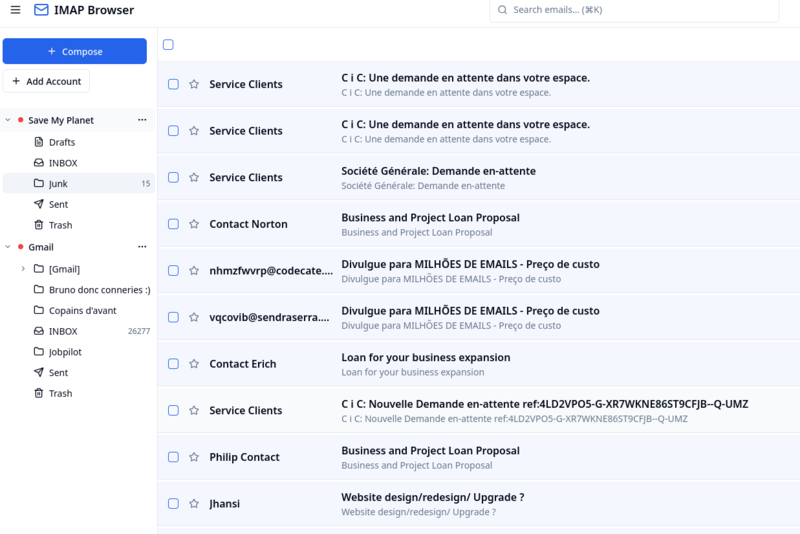
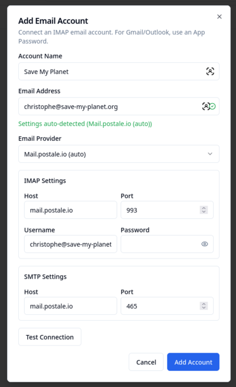
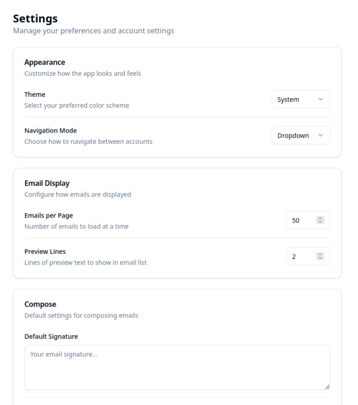

# IMAP Browser

A polished, secure, open-source web client for managing multiple IMAP email accounts.

## Screenshots



*Main inbox with multi-account support and folder tree navigation*



*Add email account with auto-configuration support*



*Customizable appearance, email display, and compose settings*

## Features

- Multi-account IMAP support with tree or dropdown navigation
- Secure credential storage (AES-256-GCM encrypted per-user)
- Real-time updates via WebSocket + IMAP IDLE
- Virtualized email list (handles large mailboxes with 60fps scrolling)
- Keyboard shortcuts (Gmail-like, press `?` for help)
- Dark mode support
- Rich text compose with TipTap editor
- File attachments with drag & drop
- Reply/Reply All/Forward
- Bulk email actions (mark read/unread, star, archive, delete, move)
- Instant email search
- Email auto-configuration via DNS/domain discovery

## Quick Start

```bash
# Install dependencies
npm install

# Build all packages
npm run build

# Initialize the database (first time only)
cd packages/server && npm run db:setup && cd ../..

# Development mode (runs both server and client)
npm run dev
```

Open http://localhost:5173 in your browser.

## Adding Email Accounts

1. Click "Add Account" in the sidebar
2. Enter your email address - settings will auto-configure for common providers
3. For Gmail: Use an [App Password](https://support.google.com/accounts/answer/185833) (not your regular password)
4. For Outlook: Use `outlook.office365.com` (port 993)
5. Click "Test Connection" to verify, then "Add Account"

## Project Structure

```
imap-browser/
├── packages/
│   ├── shared/           # Shared TypeScript types and Zod schemas
│   ├── server/           # Fastify backend
│   │   └── src/
│   │       ├── db/       # Drizzle ORM schema and database
│   │       ├── services/ # Auth, IMAP, SMTP, email operations
│   │       ├── routes/   # REST API endpoints
│   │       └── websocket/# Real-time updates
│   └── client/           # React frontend
│       └── src/
│           ├── components/
│           ├── hooks/    # React Query hooks
│           ├── stores/   # Zustand state
│           └── pages/    # Login, Mail, Settings
├── screenshots/          # Application screenshots
├── Dockerfile
├── docker-compose.yml
└── .env.example
```

## Technology Stack

### Backend
- **Fastify** - Fast HTTP framework
- **Drizzle ORM** - Type-safe SQL with SQLite
- **ImapFlow** - Modern IMAP client with IDLE support
- **Nodemailer** - SMTP for sending emails
- **Argon2** - Password hashing
- **AES-256-GCM** - Credential encryption

### Frontend
- **React 18** with TypeScript
- **Vite** - Build tool
- **TanStack Query** - Server state management
- **TanStack Virtual** - Virtualized lists
- **Zustand** - Client state
- **shadcn/ui + Radix UI** - Accessible components
- **Tailwind CSS** - Styling
- **TipTap** - Rich text editor

## Security

1. User passwords are hashed with Argon2id
2. Each user has a unique encryption salt
3. IMAP/SMTP credentials are encrypted with AES-256-GCM using a key derived from the user's password
4. Sessions use HttpOnly, Secure, SameSite=Strict cookies
5. Auth cookie expires in 15 minutes (auto-refreshed)

## API Endpoints

```
POST   /api/auth/register       Create account
POST   /api/auth/login          Login
POST   /api/auth/logout         Logout
GET    /api/auth/me             Current user

GET    /api/accounts            List IMAP accounts
POST   /api/accounts            Add account
PATCH  /api/accounts/:id        Update account
DELETE /api/accounts/:id        Delete account
GET    /api/accounts/:id/folders      List folders
POST   /api/accounts/:id/sync         Sync folders

GET    /api/accounts/:id/folders/:fid/emails    List emails
GET    /api/accounts/:id/emails/:eid            Get email
POST   /api/accounts/:id/emails/flags           Update flags
POST   /api/accounts/:id/emails/move            Move emails
POST   /api/accounts/:id/emails/delete          Delete emails

POST   /api/send                Send email
POST   /api/drafts              Save draft
GET    /api/settings            Get settings
PATCH  /api/settings            Update settings

WS     /ws                      WebSocket for real-time updates
```

## Docker Deployment

```bash
docker-compose up -d
```

Or build manually:

```bash
docker build -t imap-browser .
docker run -p 3000:3000 -v imap-data:/app/data imap-browser
```

## Environment Variables

```bash
NODE_ENV=development
PORT=3000
HOST=0.0.0.0
DATABASE_PATH=./data/imap-browser.db
COOKIE_SECRET=change-me-in-production-to-a-random-32-char-string
CORS_ORIGIN=http://localhost:5173
```

## Testing

### API Tests

```bash
bash scripts/test-api.sh
```

### Type Checking

```bash
cd packages/client && npx tsc --noEmit
cd packages/server && npx tsc --noEmit
```

## License

MIT
